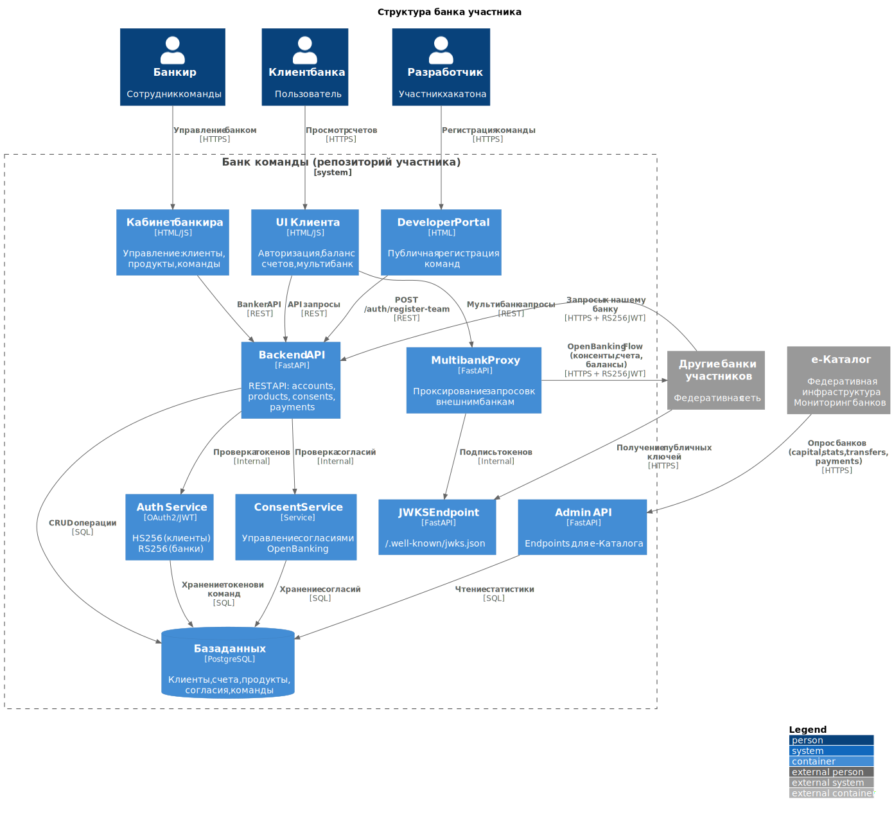
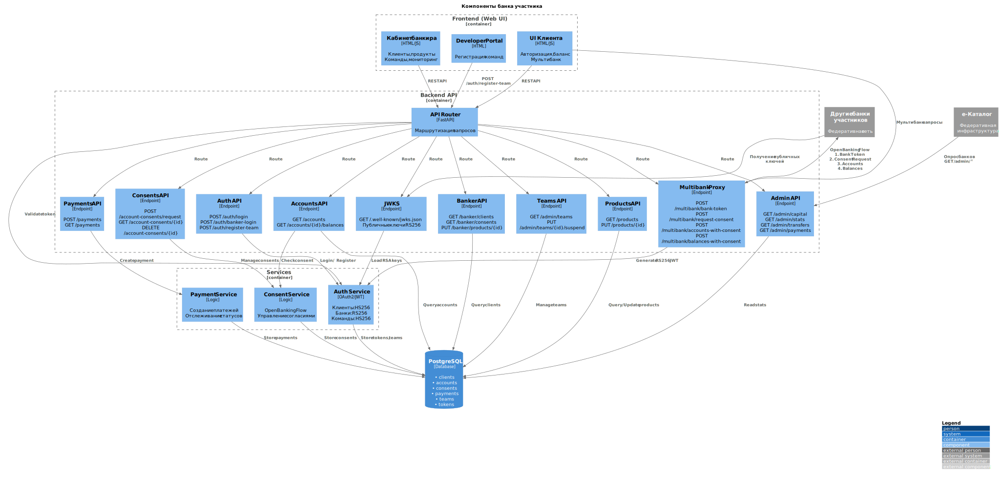
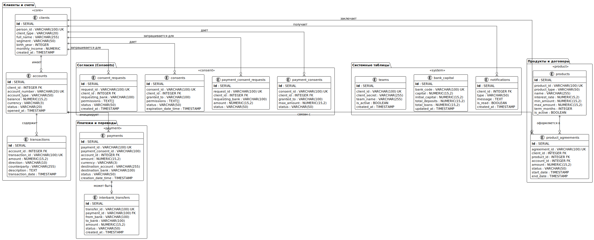

# 🏦 Bank-in-a-Box

> **Готовый шаблон банка для HackAPI 2025**  
> Создай свой собственный банк за 10 минут!

## 🎯 Что это?

**Bank-in-a-Box** — это полнофункциональный шаблон банка с OpenBanking Russia API, который ты можешь:
- Развернуть на своем сервере
- Кастомизировать под свои нужды
- Подключить к федеративной платформе HackAPI
- Использовать для разработки финтех-приложений

## 📊 Архитектурные диаграммы

<details>
<summary>🔍 Посмотреть диаграммы архитектуры</summary>

### Общая структура системы


### Детальная схема компонентов


### Схема базы данных (ER-диаграмма)


**Основные таблицы:**
- **Клиенты и счета**: `clients`, `accounts`, `transactions`
- **Платежи**: `payments`, `interbank_transfers`
- **Согласия**: `consent_requests`, `consents`, `payment_consent_requests`, `payment_consents`
- **Продукты**: `products`, `product_agreements`
- **Система**: `teams`, `bank_capital`, `notifications`

Подробная структура таблиц: [`shared/database/init.sql`](./shared/database/init.sql)

📁 Исходные PlantUML файлы и инструкции: [`docs/diagrams/`](./docs/diagrams/)

</details>

## ✨ Что уже реализовано

### API (40+ endpoints):
✅ **Accounts API** - счета клиентов (OpenBanking Russia v2.1)  
✅ **Account-Consents API** - управление согласиями  
✅ **Payments API** - платежи и переводы  
✅ **Products API** - финансовые продукты  
✅ **ProductAgreements API** - депозиты, кредиты, карты  
✅ **Multibank API** - агрегация счетов из других банков  
✅ **Banker API** - управление банком  
✅ **Admin API** - мониторинг и статистика  
✅ **JWKS** - федеративная авторизация RS256

### UI (10 страниц):
✅ **Client UI** - личный кабинет клиента (5 страниц)  
✅ **Banker UI** - кабинет банкира (4 страницы)  
✅ **Developer Portal** - регистрация команд и выдача API credentials  
✅ **Темная/светлая тема** 🌙/☀️  
✅ **Адаптивный дизайн** (Desktop/Tablet/Mobile)

### Технологии:
- **FastAPI** - современный Python web framework
- **PostgreSQL** - надежная база данных
- **SQLAlchemy** - async ORM
- **JWT** - HS256/RS256 авторизация
- **Docker** - контейнеризация

## 👥 Для участников хакатона

Вы управляете своим банком как администратор! 🎉

### ✅ Что можно делать:
- **Управлять продуктами** - создавать, редактировать ставки, лимиты
- **Изменять настройки авто-одобрения согласий** - настройте автоматическое одобрение для удобства
- **Просматривать статистику и метрики банка** - капитал, счета, платежи
- **Одобрять/отклонять запросы на согласия** - через Banker UI
- **Просматривать клиентов и их счета** - полный доступ к данным своего банка

- Вы управляете **только своим банком** (не можете изменять другие банки)

### 🔌 Endpoints для е-Каталога:

е-Каталог периодически запрашивает данные вашего банка для мониторинга:
- `GET /admin/capital` - капитал банка
- `GET /admin/stats` - статистика (счета, платежи, баланс)
- `GET /admin/transfers` - межбанковские переводы
- `GET /admin/payments` - все платежи
- `GET /admin/api-calls` - логи API вызовов (для синхронизации)

Эти endpoints должны быть доступны без авторизации для е-Каталога.

## 🚀 Быстрый старт

### Вариант 1: Docker (рекомендуется)

```bash
# 1. Клонировать репозиторий
git clone https://github.com/GalkinTech/bank-in-a-box.git
cd bank-in-a-box

# 2. Создать конфигурацию
cp .env.example .env
# Отредактируй .env - укажи название своего банка и team credentials
# SECRET_KEY можно сгенерировать: openssl rand -hex 32

# 3. Запустить
docker compose up -d

# 4. Открыть UI
open http://localhost:8080/client/
```

### Вариант 2: Локально (для разработки)

```bash
# 1. Установить зависимости
pip install -r requirements.txt

# 2. Настроить PostgreSQL
createdb mybank_db

# 3. Создать .env файл (см. раздел "Team Credentials")
# Скопируй конфигурацию из раздела выше или создай вручную

# 4. Запустить
python run.py

# Откроется на http://localhost:8000
# Примечание: локально приложение работает на порту 8000,
# в Docker на порту 8080 (из-за проброса портов)
```

## ⚙️ Кастомизация

### 1. Название и код банка

Отредактируй `.env`:
```env
BANK_CODE=mybank
BANK_NAME=My Awesome Bank
BANK_DESCRIPTION=Инновационный цифровой банк
PUBLIC_URL=http://mybank.example.com
```

### 2. Добавь свои продукты

SQL скрипт `shared/database/init.sql` содержит примеры:
```sql
INSERT INTO products (product_id, product_type, name, interest_rate, min_amount, max_amount, term_months)
VALUES 
  ('deposit-high', 'deposit', 'Премиум депозит', 12.0, 100000, 10000000, 12),
  ('loan-fast', 'loan', 'Быстрый займ', 18.0, 10000, 500000, 24);
```

### 3. Настрой ставки

Через Banker UI:
1. Открой http://localhost:8080/banker/
2. Логин: `admin` / `admin`
3. Вкладка "Products" - измени процентные ставки

### 4. Брендинг UI

Отредактируй CSS переменные в `frontend/client/theme-styles.css`:
```css
:root {
    --primary: #yourcolor;
    --bank-name: "Your Bank";
}
```

## 🔑 Team Credentials (для хакатона)

Для работы с межбанковскими операциями и Directory Service нужны учетные данные команды.

### Настройка

1. **Получите креды** от организаторов HackAPI 2025
2. **Создайте `.env` файл в корне проекта:**

```bash
# Создать файл .env
cat > .env << EOF
# Team Credentials для межбанковских операций
# team200 - замените на свой client_id от организаторов
TEAM_CLIENT_ID=team200
TEAM_CLIENT_SECRET=ваш_секретный_ключ_от_организаторов

# Настройки банка
BANK_CODE=mybank
BANK_NAME=My Awesome Bank
BANK_DESCRIPTION=Инновационный цифровой банк
PUBLIC_URL=http://localhost:8080

# Database
POSTGRES_USER=bankuser
POSTGRES_PASSWORD=bankpass
POSTGRES_DB=mybank_db

# Security (сгенерируется автоматически)
SECRET_KEY=$(openssl rand -hex 32)
ALGORITHM=HS256
ACCESS_TOKEN_EXPIRE_MINUTES=1440

# API
API_VERSION=2.1
EOF

# Отредактировать креды команды
nano .env
```

### Как это используется

Эти креды используются для:
- 🏦 **Multibank API** - агрегация счетов из других банков
- 🔐 **Consent Flow** - запрос согласий клиентов других банков
- 📡 **Directory Service** - регистрация в федеральном каталоге

**Пример использования в коде:**
```python
# Получение токена для межбанковских операций
# Замените team200 на ваш client_id
POST /auth/bank-token?client_id=team200&client_secret=YOUR_SECRET
```

## 🌐 Multibank API

Агрегация счетов клиентов из нескольких банков через OpenBanking протокол.

### Endpoints

**1. Получить банковский токен:**
```bash
POST /multibank/bank-token
{
  "bank_url": "https://otherbank.example.com"
}
```

**2. Запросить согласие клиента:**
```bash
POST /multibank/request-consent
{
  "bank_url": "https://otherbank.example.com",
  "bank_token": "eyJhbGci...",
  "client_id": "team200-1"
}
```

**3. Получить счета клиента:**
```bash
POST /multibank/accounts-with-consent
{
  "bank_url": "https://otherbank.example.com",
  "bank_token": "eyJhbGci...",
  "consent_id": "consent-abc-123",
  "client_id": "team200-1"
}
```

**4. Получить баланс счета:**
```bash
POST /multibank/balances-with-consent?account_id=acc-123&bank_url=...&bank_token=...&consent_id=...
```

### OpenBanking Flow

Правильная последовательность для получения данных из другого банка:

```
1. Bank Token      → Получить токен команды для межбанковских операций
   ↓
2. Request Consent → Запросить согласие клиента на доступ к данным
   ↓
3. Get Accounts    → Получить список счетов с использованием consent
   ↓
4. Get Balances    → Получить балансы счетов
```

**Важно:** При запросе consent необходимо передавать заголовок `x-requesting-bank` с вашим client_id (например: `team200`)!

### Использование в UI

Client Dashboard автоматически агрегирует счета из нескольких банков:
- Кнопка **"🔄 Загрузить все"** - загружает счета из всех банков
- Кнопки отдельных банков - загружают счета конкретного банка
- Автоматическая обработка неавторизованных согласий с подсказками

## 🔌 Подключение к федерации

Чтобы другие участники хакатона могли использовать твой банк:

### 1. Зарегистрируй банк в Directory Service

1. Откройте [Directory UI](https://open.bankingapi.ru/directory/participant/login.html)
2. Войдите с учетными данными команды
3. Добавьте банк через форму:
   - Organization ID: `mybank`
   - Organization Name: `My Awesome Bank`
   - JWKS Endpoint: `https://api.mybank.com/.well-known/jwks.json`
   - API Base URL: `https://api.mybank.com`

### 2. Открой API для внешних запросов

CORS уже настроен для работы с федеративной платформой! 

По умолчанию разрешены запросы с:
- `https://open.bankingapi.ru` - главная платформа HackAPI
- `http://localhost:*` - для локальной разработки
- Все банки участников (VBank, ABank, SBank)

Настройки в `main.py`:
```python
allowed_origins = [
    "https://open.bankingapi.ru",  # HackAPI Platform
    "http://localhost:8001",  # VBank
    "http://localhost:8002",  # ABank
    "http://localhost:8003",  # SBank
    # + regex для localhost:*
]
```

Если нужно добавить свой домен - отредактируй `main.py` и перезапусти контейнер.

## 🏗️ Архитектура

### Компоненты системы


**Основные компоненты:**
- **FastAPI App** - веб-сервер с 42+ API endpoints
- **PostgreSQL** - реляционная база данных (16 таблиц)
- **JWT Service** - авторизация HS256/RS256
- **Consent Service** - управление согласиями клиентов
- **Payment Service** - обработка платежей и переводов
- **Client UI** - веб-интерфейс для клиентов (5 страниц)
- **Banker UI** - административная панель (4 страницы)

## 📊 Структура проекта

```
bank-in-a-box/
├── api/                    # API endpoints
│   ├── accounts.py         # Accounts API
│   ├── consents.py         # Consents API
│   ├── payments.py         # Payments API
│   ├── products.py         # Products API
│   ├── product_agreements.py
│   ├── multibank_proxy.py  # Multibank API (NEW!)
│   ├── banker.py           # Banker API
│   ├── admin.py            # Admin API
│   ├── auth.py             # Авторизация
│   └── well_known.py       # JWKS endpoint
│
├── services/               # Бизнес-логика
│   ├── auth_service.py     # JWT + RS256
│   ├── consent_service.py  # Управление согласиями
│   └── payment_service.py  # Платежи и переводы
│
├── frontend/               # UI
│   ├── client/             # Client UI (5 страниц)
│   └── banker/             # Banker UI (4 страницы)
│
├── shared/                 # Общие ресурсы
│   ├── database/           # SQL init скрипты
│   └── keys/               # RSA ключи
│
├── main.py                 # FastAPI app
├── models.py               # SQLAlchemy models (16 таблиц)
├── config.py               # Конфигурация
├── database.py             # Async PostgreSQL
├── docker-compose.yml      # Docker конфигурация
├── Dockerfile              # Docker образ
└── requirements.txt        # Python зависимости
```

## 🗄️ База данных

### Таблицы (16 шт):

1. **clients** - клиенты банка
2. **accounts** - счета клиентов
3. **transactions** - транзакции
4. **products** - финансовые продукты
5. **product_agreements** - договоры (депозиты, кредиты, карты)
6. **consents** - согласия клиентов
7. **consent_requests** - запросы на согласия
8. **payments** - платежи
9. **interbank_transfers** - межбанковские переводы
10. **bank_capital** - капитал банка
11. **bank_settings** - настройки
12. **auth_tokens** - токены авторизации
13. **notifications** - уведомления
14. **key_rate_history** - история ключевой ставки ЦБ

### Изменения в базе данных

Структура БД определена в `shared/database/init.sql`.

**Для применения изменений:**
```bash
# 1. Отредактируйте init.sql
nano shared/database/init.sql

# 2. Пересоздайте базу данных
docker compose down -v
docker compose up -d
```

**Важно:** При пересоздании БД все данные будут удалены и созданы заново из `init.sql`.

## 🧪 Тестирование

### 1. Через UI

Открой http://localhost:8080/client/

**Тестовые клиенты команды:**
- `team200-1` до `team200-10` / `password`

**Demo клиенты:**
- `demo-client-001`, `demo-client-002`, `demo-client-003` / `password`

### 2. Через Swagger

Открой http://localhost:8080/docs

### 3. Через curl

```bash
# Авторизация
curl -X POST http://localhost:8080/auth/login \
  -H "Content-Type: application/json" \
  -d '{"username": "team200-1", "password": "password"}'

# Получить счета
curl -X GET http://localhost:8080/accounts \
  -H "Authorization: Bearer YOUR_TOKEN"
```

## 📡 API Endpoints

### Auth API
- `POST /auth/login` - авторизация клиента
- `POST /auth/bank-token` - токен для межбанковских запросов
- `POST /auth/banker-login` - авторизация банкира
- `GET /auth/me` - информация о текущем пользователе

### Accounts API (OpenBanking Russia v2.1)
- `GET /accounts` - список счетов
- `GET /accounts/{accountId}` - детали счета
- `GET /accounts/{accountId}/balances` - баланс
- `GET /accounts/{accountId}/transactions` - транзакции
- `POST /accounts` - создать счет
- `DELETE /accounts/{accountId}` - закрыть счет

### Account-Consents API (OpenBanking Russia v2.1)
- `POST /account-consents/request` - запросить согласие
- `POST /account-consents/sign` - подписать согласие
- `GET /account-consents/my-consents` - мои согласия
- `GET /account-consents/requests` - запросы на согласие
- `POST /account-consents/requests/{id}/approve` - одобрить
- `POST /account-consents/requests/{id}/reject` - отклонить
- `DELETE /account-consents/{consentId}` - отозвать согласие

### Payments API
- `POST /payments` - создать платеж
- `GET /payments/{paymentId}` - статус платежа

### Multibank API 
- `POST /multibank/bank-token` - получить токен банка для межбанковских операций
- `POST /multibank/request-consent` - запросить согласие клиента другого банка
- `POST /multibank/accounts-with-consent` - получить счета клиента с использованием consent
- `POST /multibank/balances-with-consent` - получить балансы счетов

### Products API
- `GET /products` - каталог продуктов
- `GET /products/{productId}` - детали продукта

### ProductAgreements API
- `GET /product-agreements` - список договоров
- `POST /product-agreements` - открыть продукт
- `GET /product-agreements/{agreementId}` - детали
- `DELETE /product-agreements/{agreementId}` - закрыть

### Banker API
- `GET /banker/products` - все продукты
- `PUT /banker/products/{id}` - изменить ставки
- `POST /banker/products` - создать продукт
- `GET /banker/clients` - список клиентов
- `GET /banker/consents` - запросы на согласия

### Admin API
- `GET /admin/capital` - капитал банков
- `GET /admin/stats` - статистика
- `GET /admin/transfers` - межбанковские переводы
- `GET /admin/payments` - все платежи
- `GET /admin/key-rate` - ключевая ставка ЦБ (только чтение)
- `GET /admin/key-rate/history` - история изменений ставки

### JWKS
- `GET /.well-known/jwks.json` - публичные ключи для RS256

## 🔐 Безопасность

### Авторизация

**Client tokens** - HS256 JWT:
```json
{
  "sub": "cli-mybank-001",
  "type": "client",
  "bank": "self"
}
```

**Bank tokens** - RS256 JWT:
```json
{
  "sub": "mybank",
  "type": "bank",
  "iss": "mybank",
  "aud": "interbank"
}
```

### Согласия (Consents)

Для межбанковских запросов требуется согласие клиента:
```http
GET /accounts?client_id=cli-001
Authorization: Bearer BANK_TOKEN
X-Consent-ID: consent-abc-123
X-Requesting-Bank: otherbank
```

## 🌐 Деплой в продакшн

### 1. На VPS/VDS

```bash
# Скопируй на сервер
scp -r bank-in-a-box/ user@server:/opt/

# Настрой nginx
sudo nano /etc/nginx/sites-available/mybank

# SSL через certbot
sudo certbot --nginx -d api.mybank.com

# Запусти
cd /opt/bank-in-a-box
docker compose up -d
```

### 2. На Kubernetes

```bash
# Создай deployment
kubectl apply -f k8s/deployment.yml

# Создай service
kubectl apply -f k8s/service.yml

# Настрой ingress
kubectl apply -f k8s/ingress.yml
```

## 🎉 Успехов на хакатоне!